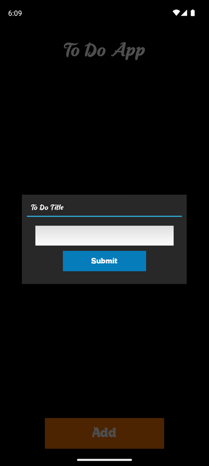
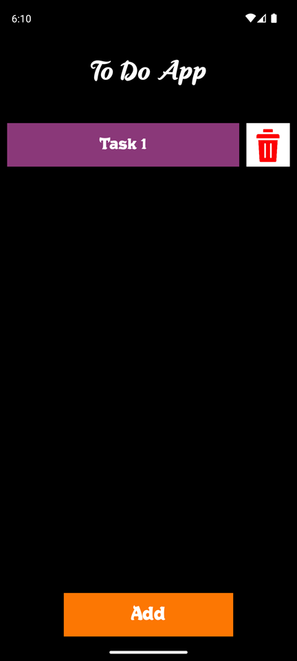
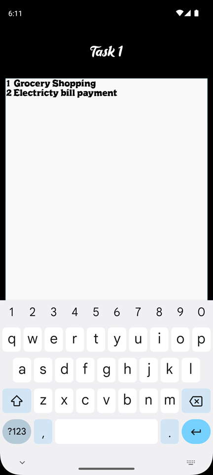
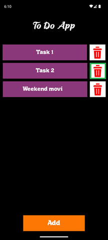
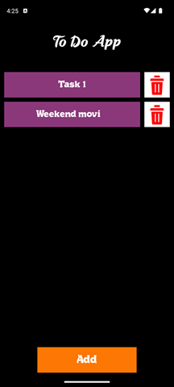

# To-Do App (Kivy)

This is a simple To-Do application built using the Kivy framework. The app allows users to add, delete, and manage tasks efficiently.

## Features
- Add new tasks
- Delete tasks
- Save tasks locally
- Responsive UI using Kivy

## Requirements
Make sure you have the following installed before running the application:
- Python > 3.8
- Kivy, KivyMD
- Buildozer (for building APK)

## Installation
1. Clone this repository or copy the source files.
2. Install dependencies using:
   ```bash
   python -m pip install kivy kivymd  
   ```

## Running the Application
Run the following command in the terminal:
```bash
python main.py
```

## Building the APK with Buildozer
To convert the Kivy app into an Android APK, follow these steps:

1. Install Buildozer:
   ```bash
   pip install buildozer
   sudo apt update && sudo apt install -y git zip unzip openjdk-17-jdk python3-pip python3-venv
   ```

2. Initialize Buildozer inside your project directory:
   ```bash
   buildozer init
   ```
   This will create a `buildozer.spec` file.

3. Edit the `buildozer.spec` file:
   - Set `title` and `package.name`.
   - Ensure `requirements` include `kivy` and `kivymd` (if used).
   - Uncomment and set `android.permissions` if required.

4. Build the APK:
   ```bash
   buildozer -v android debug
   ```

5. Once the build is complete, find the APK in `bin/` directory and install it on your Android device:
   ```bash
   adb install bin/*.apk
   ```

  ### Or you can simply convert the kivy app into apk using [Google Colab](https://colab.research.google.com/drive/16EHbKfoyAm_9gCZLnwW42hLE4tqKNLG2#scrollTo=7vwhOIgbjlbC)

## ToDo App UI

Presplash Screen            |  User Interface
:-------------------------:|:-------------------------:
   |  

Adding a todo            |  UI after todo gets added
:-------------------------:|:-------------------------:
   |   
Click the add button to add a todo and then enter the todo title | Todo is added to the main screen 

Add details inside a todo        |  ToDo details UI
:-------------------------:|:-------------------------:
   |   
Click the ToDo in which you want to add the details, here I'm adding details to the Task 1 | Enter the details you want to add and go back to the main page the data will stored automatically


Delete a ToDo           |  UI after deleting a ToDo
:-------------------------:|:-------------------------:
   |   
Simply click the delete button next to the ToDo  | When a ToDo is deleted all the other ToDo's are rearranged so there is not empty space at the deleted todo position 

<hr>

## License
This project is open-source. Feel free to modify and use it as per your requirements.


